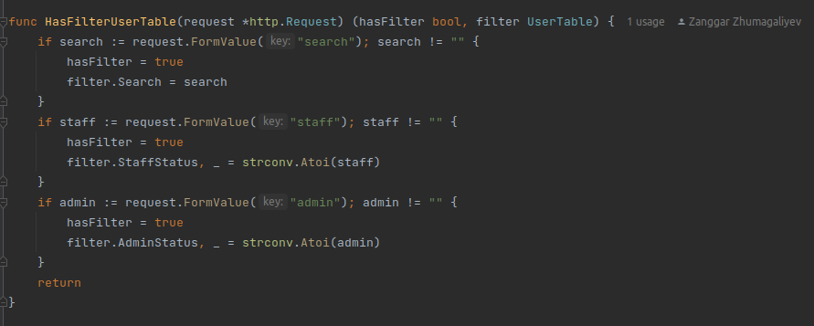

# Report

[Link to video explanation](https://youtu.be/zDDMd2p2Df4)

[Link to midterm commit](https://github.com/tazhibayda/sdu.store/tree/105c5cf6915d60514f77e7c9d392b54ace8009c8)


## Introduction:
SDU store is an online store that offers various products for sale. The store has three types of users, including clients, staff, and admin. Each user has different levels of access to the store's functionalities.

Client User Access:
The client user is the basic user of the SDU store. Clients can browse through the store's product catalog, view product details, add items to the cart, and make purchases. They can also track their order status, view their order history, and manage their account settings.

Staff User Access:
Staff users have additional privileges compared to client users. They can access the store's backend system, allowing them to change product data, add or remove categories, and manage delivery settings. They can also view orders and customer details, and they have the ability to cancel orders and issue refunds.

Admin User Access:
Admin users have the highest level of access to the SDU store's functionalities. They can perform all the tasks that staff users can do and more. Admin users have access to user data, and they can change user roles, such as changing a client user to a staff user or an admin user. They can also access the store's financial reports and view detailed sales data.

## What We Did?

This report summarizes the progress we have made on our project until Midterm 1. The project involves the development of an online platform that offers various products for sale. We have implemented several features, including the index page style, authentication, and an admin site with user and category management.

Index Page Style:
The index page is the main page of the website that users see when they visit the site. We have implemented a clean and modern design for the index page that is both visually appealing and easy to navigate. The index page displays the latest products and offers, allowing users to quickly browse through the store's offerings.

Authentication:
We have implemented an authentication system that ensures the security of the website. Users can create an account, log in, and log out securely. The system also includes password reset functionality and email verification.

Admin Site:
The admin site is a backend system that allows the admin and staff users to manage the website's data. The admin site includes a user management feature that allows the admin to manage the user table. The admin can view and delete user data, as well as change user roles, but cannot edit user data. The staff users have access to the category management feature, where they can manage the category table. They can view, add, edit, and delete categories.

Filter and Search Function:
Both the user and category management features include a filter and search function. The filter function allows users to sort and filter data by different criteria, such as name, date, or status. The search function allows users to search for specific data by entering keywords.

## Team members


- 200103210 Daryn Tazhibay
- 200103371 Nurali Umirzak
- 200103287 Zanngar Zhumagiyev
- 200103251 Diyarova Aruzhan
- 200103429 Nurdaulet Kalidolla

### What each member did

Aruzhan:
Aruzhan has made significant contributions to the project by designing and coding the index page, admin login-page, admin main page, logout feature. 

Nurali:
Nurali has been responsible for the design and code of the login, sign-up, and sign-in pages

Nurdaulet:
Nurdaulet has been responsible for the design and code of all pages related to the admin site. 

Daryn:
Daryn has been responsible for the initial project initialization, database management, authorization, and authentication. 

Zanggar:
Zanggar has been responsible for the backend development of the admin pages. He has implemented filtering, searching, and table management functionalities.

## How To Run The Code?
Instructions for Running the Project:

1. Create the PostgreSQL database.
Before you can run the project, you need to create a PostgreSQL database. You can use a tool like pgAdmin or the psql command-line tool to create the database.

2. Create dbInfo.go file
Create a new file called dbInfo.go in the root directory of the project. This file should contain the information required to connect to the database. Use the following format for the file:


3. Make sure to replace password, username and database name with your actual PostgreSQL database password and database name, respectively.Make sure to replace your_password_here and your_database_name_here with your actual PostgreSQL database password and database name, respectively.  

4. Run the code
   To run the code, open a terminal and navigate to the project's root directory. Then, run the following command:
```
go run . -dbRestart
```

5. This command will start the server and automatically create the necessary database tables. If you make any changes to the database schema, you can use the -dbRestart flag to drop and recreate the tables.

Once the server is running, you can access it by opening a web browser and navigating to http://localhost:9090. From there, you can browse the products, add items to your cart, and complete orders. The admin site can be accessed by logging in with an admin or staff account.

## Explanation Of Each Feature

Let's start with Authentication and Authorization.  


### Registration

In our case, when a user submits the registration form, we receive a POST request containing their information. We first check that the password and retyped password match to ensure that the user has typed their password correctly. Then, we validate the user's information, making sure that the username and email are not already in use by another user and that the password meets certain requirements such as having a lowercase letter, uppercase letter, and digit.

  


### Login 

In our case, when a user submits the login form, we receive a POST request containing their username and password. We then retrieve the user record from the database that corresponds to the username entered by the user. If a user with that username exists in the database, we check the password they entered against the hashed password stored in the database.

If the passwords match, we generate a JSON Web Token (JWT) to authenticate the user for subsequent requests. This token is then set as a cookie in the response, allowing the user to remain authenticated as they navigate through the web application.

  
  
  

### Authentication And Authorization

When a user logs in, we generate a JWT containing information about the user, such as their user ID and whether they are a staff member or an administrator. We then store this JWT in a cookie on the user's browser.

When a user makes a subsequent request, we check for the presence of the JWT in the cookie. If the JWT is present and valid, we use it to authenticate the user and allow them to access the requested resource. If the JWT is missing or invalid, we redirect the user to the login page.

Authorization is the process of determining what resources a user is authorized to access. In our application, we use the isStaff and isAdmin attributes of the user record in the database to determine whether a user is authorized to access certain resources. For example, only staff members are authorized to modify product categories, while only administrators are authorized to modify user records.
  
  
  
  
  

### Logout

In our application, when a user clicks the "Logout" button, we perform the following steps:

1. We authenticate the user by checking for the presence of a valid JWT in the cookie.
2. If the user is authenticated, we update their user record in the database by setting the deleteAt attribute to the current time.


### Admin page
Authentication works the same as other pages, but there has access only to staff and admin, admin login page works the same as the login page, and logout works the same as the main logout function. Admin page has access given tables to management

  

### Users and User page

The users page in our web application is designed to provide administrators with access to all user data, and the ability to edit and delete user accounts. Here's how it works:

1. Access Control: The users page can only be accessed by administrators, who have been granted access to this feature. Regular users and staff members are redirected to the main page when they attempt to access the users page.

2. User Data: When an administrator accesses the users page, they can see all user data, including usernames, email addresses, and other details. This allows them to manage user accounts and ensure that our web application is being used in accordance with our policies.

3. Edit and Delete: Administrators can edit and delete user accounts from the users page. When editing a user account, administrators can modify certain details, such as the role of the user (e.g. staff or admin). However, they cannot change the username or email address of the user, as this could cause confusion or disruption.

4. Request Handling: When a user requests access to the users page, the web application will return the page and display all user data. If a user submits a post request with the query parameter 'delete', the web application will delete the selected user account. If the request does not include the 'delete' parameter, the web application will assume that the administrator wishes to edit the user account, and will provide them with the necessary form fields to make modifications.
5. New User: It works same as sign-up function.
 
  
  
 
  

### Categories and Category

This pages works same as Users and User pages. But, for this pages, also staffs has access and also can edit name of category.
  
  
  

### Search and filter functions

Both Tables works same filter and search functions.

To search and filter content on a website, it is often helpful to use additional structs or data structures that can help organize the data and provide specific attributes to the HTML pages. These attributes can then be used for searching and filtering the content.

Before searching and filtering, it is important to determine whether there is a need to do so. This can be done by checking if there are any filter attributes in the user's request. If there are, then the attributes are passed to the previously defined structs.

Once the attributes are in the structs, filtering can be done using the provided filter parameters. This means that only the content that matches the specified parameters will be displayed to the user.

  
  
  
  
  
  
