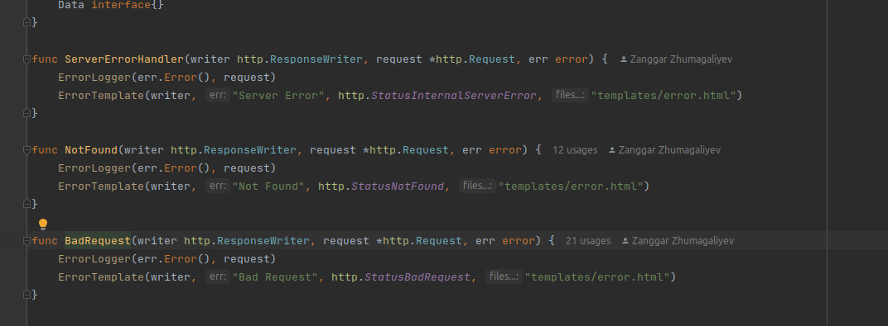

# Report

[Link to video explanation](https://drive.google.com/file/d/1NCftXRYl5FRLOGt_eH8Oe1LhCDJ50nMs/view?usp=sharing)

## Introduction:
SDU store is an online store that offers various products for sale. The store has three types of users, including clients, staff, and admin. Each user has different levels of access to the store's functionalities.

Client User Access:
The client user is the basic user of the SDU store. Clients can browse through the store's product catalog, view product details, add items to the cart, and make purchases. They can also track their order status, view their order history, and manage their account settings.

Staff User Access:
Staff users have additional privileges compared to client users. They can access the store's backend system, allowing them to change product data, add or remove categories, and manage delivery settings. They can also view orders and customer details, and they have the ability to cancel orders and issue refunds.

Admin User Access:
Admin users have the highest level of access to the SDU store's functionalities. They can perform all the tasks that staff users can do and more. Admin users have access to user data, and they can change user roles, such as changing a client user to a staff user or an admin user. They can also access the store's financial reports and view detailed sales data.

## What We Did?
We added logging middleware to help us track and manage user activities and access levels. This would help us maintain a record of user actions and troubleshoot any issues that arise.(Aruzhan)


We added error handlers to improve the user experience and make it easier for users to troubleshoot any issues that arise. These error handlers would provide clear and concise messages to help users understand what went wrong and how to fix it.(Zanggar)





We added a products table to help organize and manage product information. We also created products management functions for admin and staff members, allowing them to easily add, edit, and delete product information.(Daryn)


We added items for products, along with items management functions for admin and staff members. This would help users view and manage individual items related to each product.(Nurali)


We implemented filter functions for each table, making it easier for users to search and sort through data. This would help users find the information they need quickly and efficiently.(Aruzhan)


We added comment and rating functions for products, allowing users to leave feedback and ratings on individual products. This would help other users make informed decisions about which products to purchase.(Zanggar)

## Team members


- 200103210 Daryn Tazhibay
- 200103371 Nurali Umirzak
- 200103287 Zanngar Zhumagiyev
- 200103251 Diyarova Aruzhan
- 200103429 Nurdaulet Kalidolla

## How To Run The Code?
Instructions for Running the Project:

1. Create the PostgreSQL database.
   Before you can run the project, you need to create a PostgreSQL database. You can use a tool like pgAdmin or the psql command-line tool to create the database.

2. Create dbInfo.go file
   Create a new file called dbInfo.go in the root directory of the project. This file should contain the information required to connect to the database. Use the following format for the file:


3. Make sure to replace password, username and database name with your actual PostgreSQL database password and database name, respectively.Make sure to replace your_password_here and your_database_name_here with your actual PostgreSQL database password and database name, respectively.

4. Run the code
   To run the code, open a terminal and navigate to the project's root directory. Then, run the following command:
```
go run . -dbRestart
```

5. This command will start the server and automatically create the necessary database tables. If you make any changes to the database schema, you can use the -dbRestart flag to drop and recreate the tables.

Once the server is running, you can access it by opening a web browser and navigating to http://localhost:9090. From there, you can browse the products, add items to your cart, and complete orders. The admin site can be accessed by logging in with an admin or staff account.