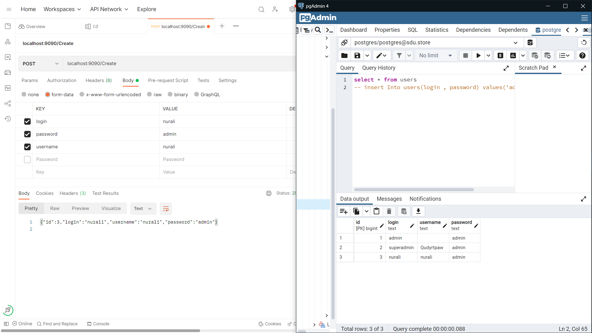
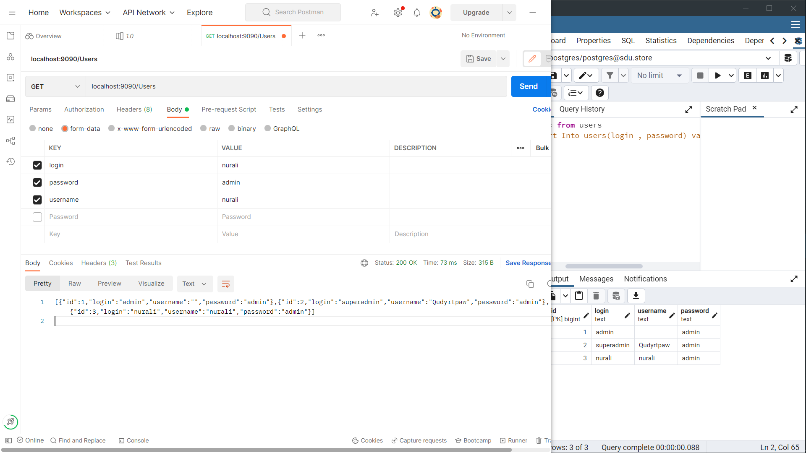

#   Progress Report 1 sdu.store

---
Team members
---
- 200103210 Daryn Tazhibay
- 200103371 Nurali Umirzak
- 200103287 Zanngar Zhumagiyev 
- 200103251 Diyarova Aruzhan
- 200103429 Nurdaulet Kalidolla

Our Idea
---

sdu.store is an e-commerce platform based on the real shop located at Suleyman Demirel University (SDU). The online store has been developed using the Go programming language as part of a project. The platform offers a unique shopping experience for students and alumni of SDU.

The online store offers a wide range of products that are also available in the physical shop, including university-branded merchandise, study essentials, fashion and lifestyle products, and much more. Customers can easily navigate the website and make purchases with a few clicks.

In addition to the convenience of online shopping, sdu.store also offers special discounts and promotions for students and alumni of SDU. This makes the store a great place for them to find affordable products while showing their university pride.

With the goal of providing a seamless shopping experience, sdu.store aims to become a popular destination for students and alumni of SDU to purchase products both online and in-store. By leveraging the technology and programming skills developed in this project, the store hopes to provide a convenient and affordable shopping experience for the university community.

What we use
---
Golang framework net/http for server side 

sdu.store has been developed using Go programming language and leverages several popular libraries and tools. The platform is built using the Go standard library's net/http package for handling HTTP requests and responses.

For database management, the platform uses gorm, a high-level ORM (Object-Relational Mapping) library for Go. This allows for easy interaction with the database and simplifies the process of storing and retrieving data from the database. The platform uses PostgreSQL as its database management system, which is a powerful and open-source relational database management system.

By utilizing these tools, sdu.store provides a fast, reliable, and scalable platform for online shopping. The use of Go, gorm, and PostgreSQL allows the platform to efficiently manage and process large amounts of data, ensuring a seamless shopping experience for customers.

What we did
---

The sdu.store platform uses a relational database management system to store and manage customer information. The database consists of three main tables: User, Session, and Userdata.

The User table stores information about the platform's registered users, including their login credentials (username and password), and unique ID. The Login and Username fields provide a way to identify users, while the Password field is used to securely store users' passwords.

The Session table stores information about the current session of each user. This includes the user's ID, a unique UUID that identifies the session, the time when the session was created, and the time of the user's last login. The DeletedAt field is used to store the time when the session has ended, allowing for easy management of expired sessions.

The Userdata table stores additional information about each user, including their first and last name, phone number, country code, ZIP code, and birthday. The UserId field is used to link the user's data to their account in the User table.

By using these tables, the sdu.store platform can efficiently manage and store customer information while ensuring data privacy and security. The use of a relational database management system allows for efficient querying and manipulation of the data, providing a robust and scalable solution for the platform's needs.

We created standard CRUD system for the first week, get User, Get All Users, Create User

