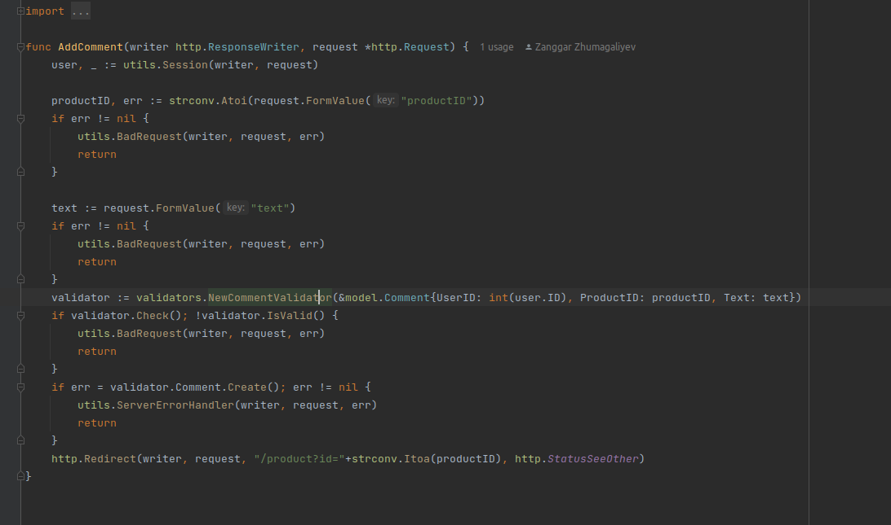
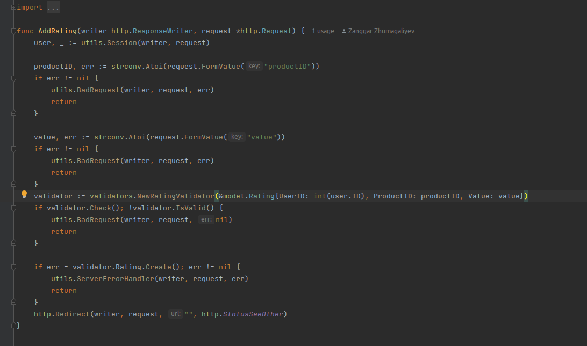
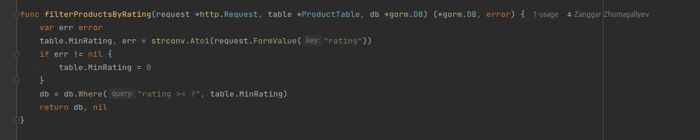
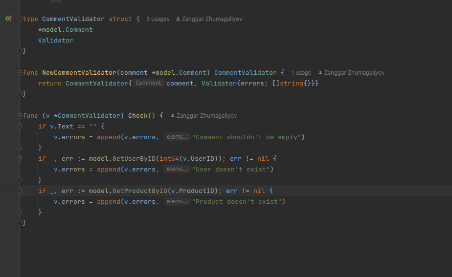
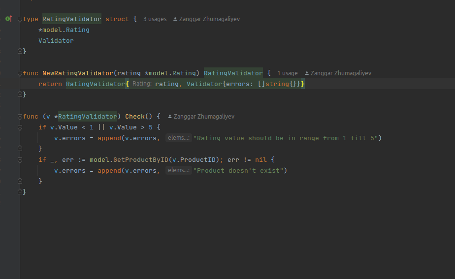
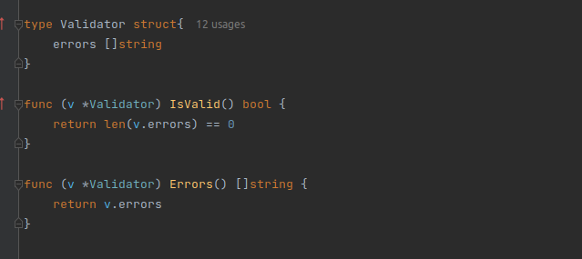

# Progress Report 10

During the past week, our team has been working on developing new functionalities for our e-commerce platform. Specifically, we focused on four main tasks: product item function, retrieving products of a certain category, product filter function with a rating filter, and rating add function. Below is a detailed overview of our progress and achievements in each area.

## What we did?
- Comments function
- Ratings
- Filter by rating
- Better user Handler

Comments Function: We added a comment function to allow users to leave feedback and comments on individual products. This would help other users make informed decisions about which products to purchase and would also provide valuable feedback for our team to improve the overall project.

Ratings Function: We also added a rating function to allow users to rate individual products. This would help users quickly and easily indicate their satisfaction with a particular product and help other users make informed decisions about which products to purchase.

Filter by Rating: To help users quickly and easily find highly rated products, we added a filter by rating function. This would allow users to sort products by the highest ratings, making it easier to find the most popular and highly rated products.

Better User Experience: Additionally, we made several improvements to the overall user experience of the project. We optimized the interface for mobile devices, making it easier for users to access and use the project on their smartphones and tablets. We also improved the layout and design of several pages, making them more visually appealing and easier to navigate.

