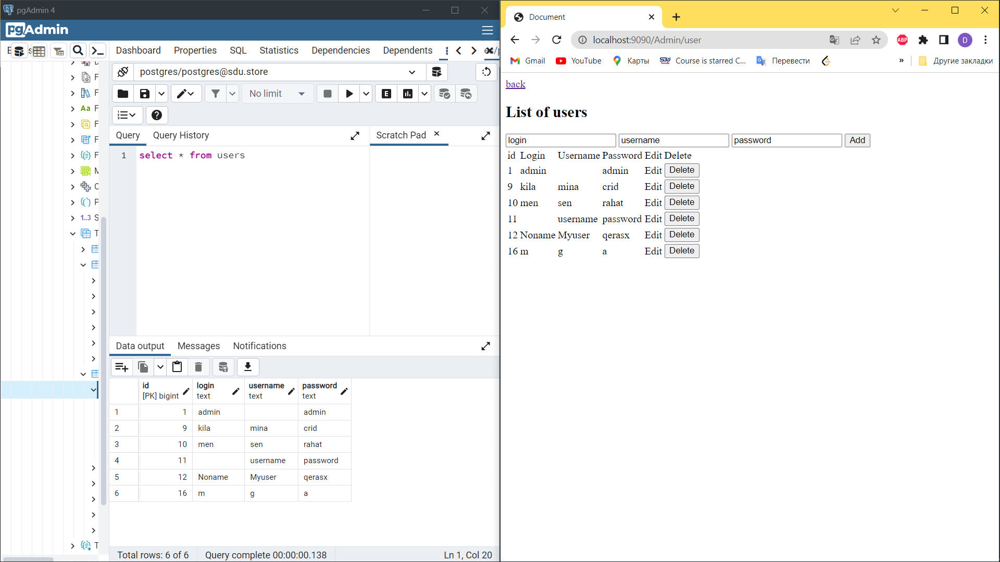
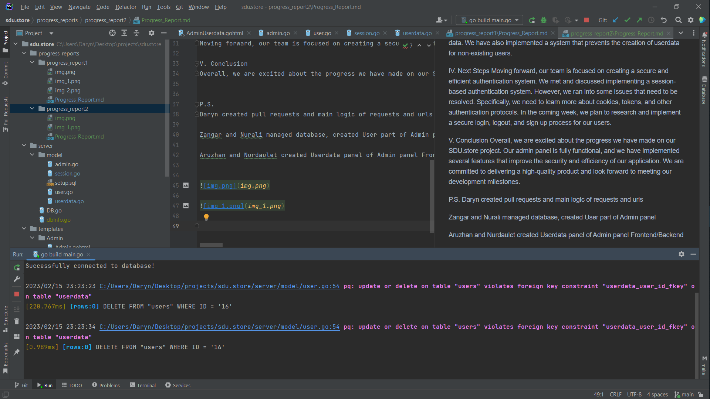
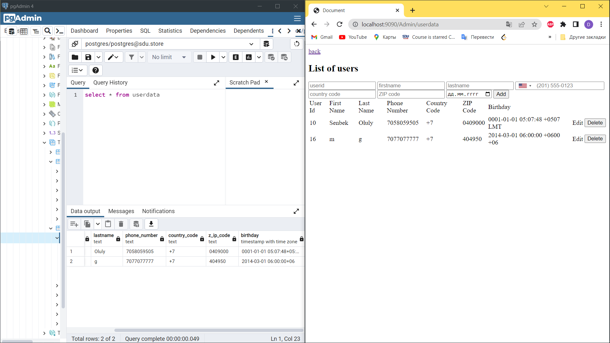

#   Progress Report 2 sdu.store

we have hidden the data of our db, and if you suddenly want to test on your computer: on the model folder, create a file dbInfo.go and put the code there

```
package server

const (
Host     = "localhost"
Port     = 5432
Username = "postgres"
Password = "admin"
Dbname   = "postgres"
)
```


[SDU.store] Progress Report
[Date]

I. Executive Summary
We are making great strides on our SDU.store project. Our admin panel is up and running, which enables us to easily create and delete users. We have also implemented a system that prevents the creation of duplicate user accounts. Additionally, we have improved our database structure by adding foreign keys and unique values, which we neglected in the first week of development.However, we did encounter a significant setback when we had problems with Github that caused our project to crash. We eventually fixed the issue by reverting and committing several times, but it did result in some lost time.

II. Development Progress
Our team has decided to upgrade our initial plan of creating structs to implementing a more efficient system. As a result, we have optimized our user data storage and retrieval process. We have also implemented a check that prevents the creation of a user account if it already exists in the database.

III. Database Improvements
We have made several significant improvements to our database structure. Specifically, we have added foreign keys and unique values, such as unique login and username, which enhance the integrity of our data. We have also implemented a system that prevents the creation of userdata for non-existing users.

IV. Next Steps
Moving forward, our team is focused on creating a secure and efficient authentication system. We met and discussed implementing a session-based authentication system. However, we ran into some issues that need to be resolved. Specifically, we need to learn more about cookies, tokens, and other authentication protocols. In the coming week, we plan to research and implement a secure login, logout, and sign up process for our users.

V. Conclusion
Overall, we are excited about the progress we have made on our SDU.store project. Our admin panel is fully functional, and we have implemented several features that improve the security and efficiency of our application. We are committed to delivering a high-quality product and look forward to meeting our development milestones.


P.S.
Daryn created pull requests and main logic of requests and urls

Zangar and Nurali managed database, created User part of Admin panel 

Aruzhan and Nurdaulet created Userdata panel of Admin panel Frontend/Backend








