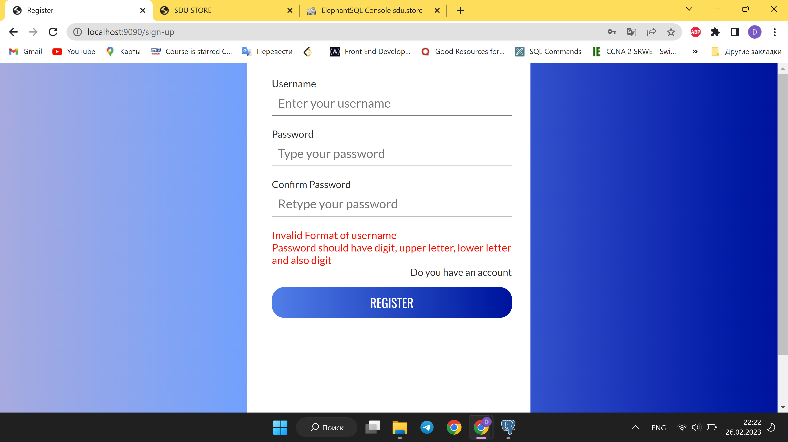

# Progress Report 3

### Overview
This week, our team made great progress on our project. We started by attempting to connect to an online database, but due to slow response times, we decided to switch back to a local Postgres database. We also added a validator and created new tables in the database.

### Database Updates
The new tables we added to the database include:

- Category: to store information about different types of clothing.
- Delivery: to track the status of orders and deliveries.
- Delivery_item: to keep track of the count of new clothes from the last order.
- Item: to store information about a product such as size, color, and name.
- Item_image: to store images of the clothes.
- Product: to store information about a product's category and price.
- Product_info: to store the full text of a product.
- Supplier: to keep track of information about the user who purchased the product.

Additionally, we rewrote all of our table code to include sequences, which automatically generate unique IDs for each new record. We also added foreign keys to our tables to help ensure data integrity and make it easier to manage relationships between tables. you can see in server/model/setup.sql

### Testing
We also added an index page (HTML and CSS) and new links for testing. We divided tasks among ourselves and created new branches, which we later merged.

### Next Steps
Our main task for the next week is to create a login authentication and cookie. We plan to update other parts of the project during the coding process, such as adding new tables to the admin panel. However, we encountered difficulties with authentication and session management, especially with tokens. We need to research more about different authentication methods, such as JWT or OAuth, to overcome these challenges.

### Conclusion
Overall, we had a productive week and achieved many of our goals. We hope to continue this momentum in the coming weeks and make more progress in our project.

