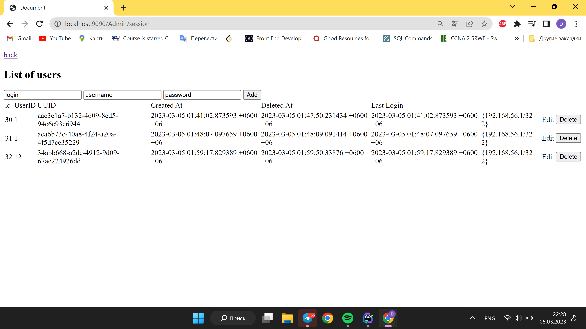
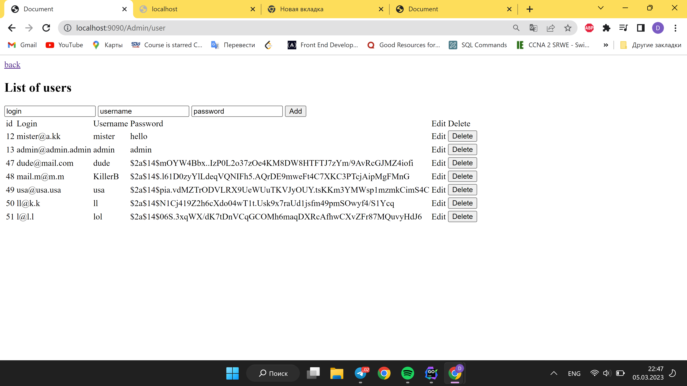
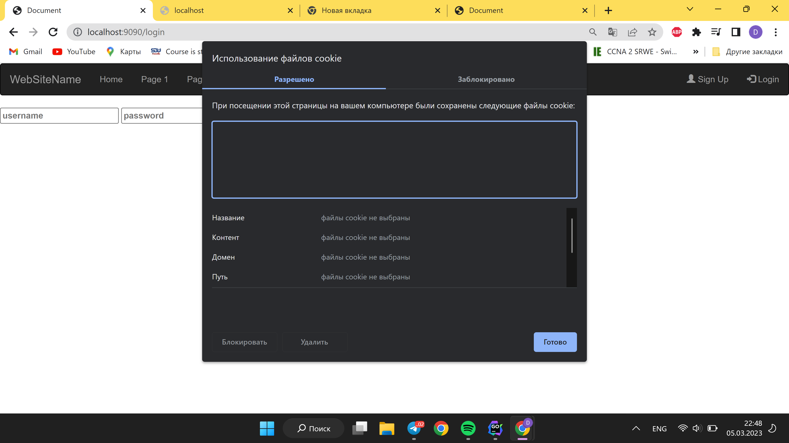
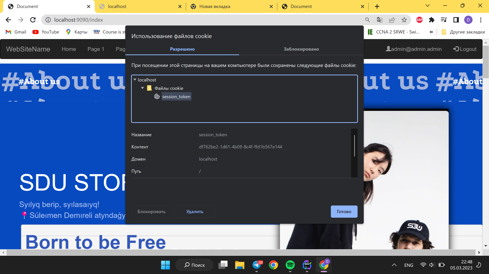
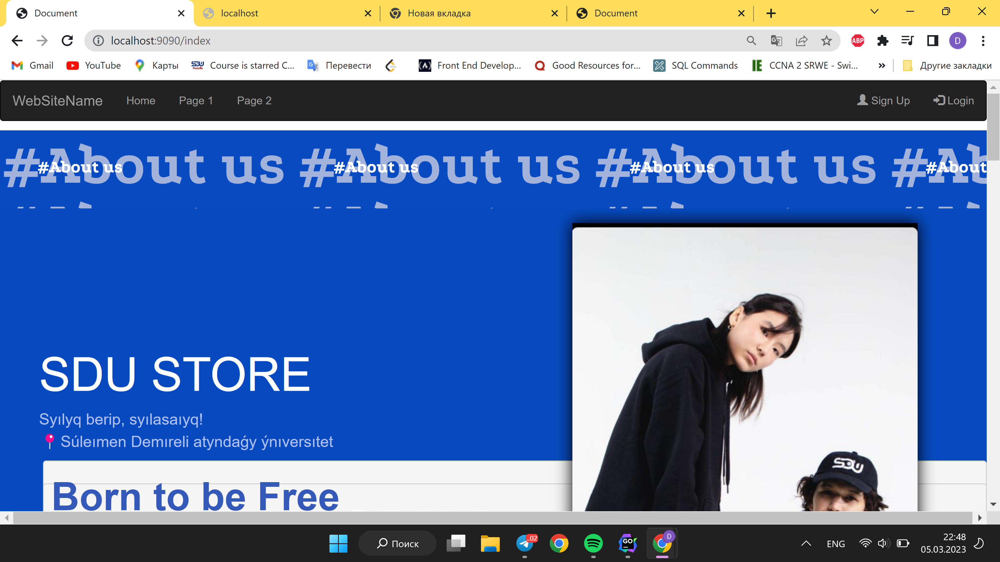

# Progress Report 4 sdu.store

### Authentication Updates:

- Implemented authentication with cookie and uploaded it to the database
- Implemented SignUp, Login, and Logout functions that work correctly
- Stuck with problems related to token and cookie, but solved them gradually
- Created header for all pages

### Admin Panel Updates:

- Upgraded admin panel and added bootstrap
- Added new features to the admin panel, such as creating and deleting users, categories, and products
- Fixed bugs in the admin panel
- Tested the admin panel thoroughly

### Header Updates:

- Created header for all pages
- Fixed a bug where the header couldn't be included in some pages
- Added links to the header for easy navigation

### Next Week Tasks:
- Implement user's personal account page, where they can change their data and password
- Create a main page for the store that displays products and categories

