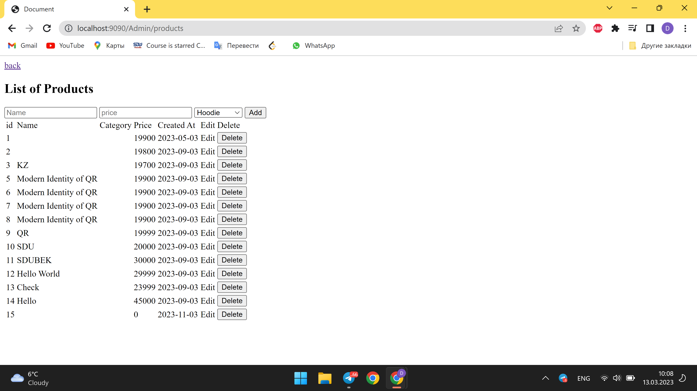
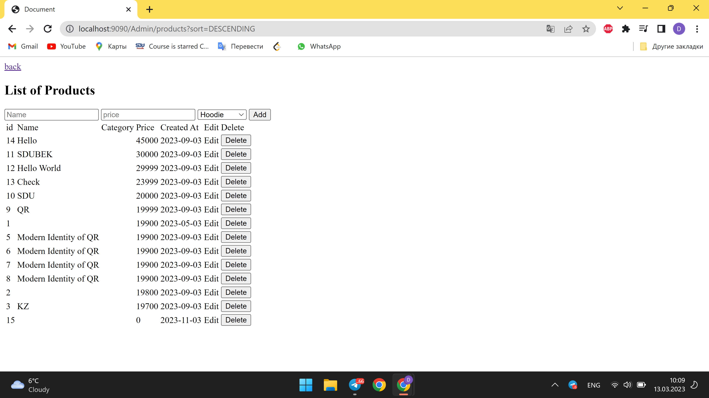
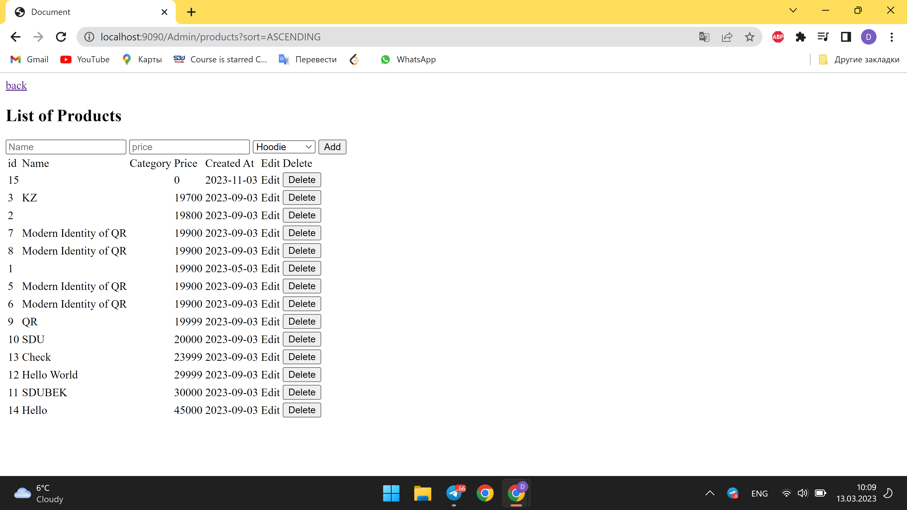

# Progress Report 5 sdu.store

In this week, we focused on preparing our project for the midterm. We implemented sorting and searching functionality on the admin page, which will help to manage the data more efficiently. We also started working on creating a card of items in the shop.

However, we ran into some issues with adding parameters to links using JavaScript. We are currently working on resolving this problem and hope to have it resolved soon.

In addition, we continued to work on improving the overall user experience of the project. We made updates to the header section to improve navigation throughout the site.

Moving forward, we plan to focus on creating the user's personal account page, where they can manage their data, password, and other personal information. We also plan to work on creating the main page of the shop, where customers can browse and purchase items.

Overall, we feel that we have made good progress this week and are on track to meet our midterm goals.

