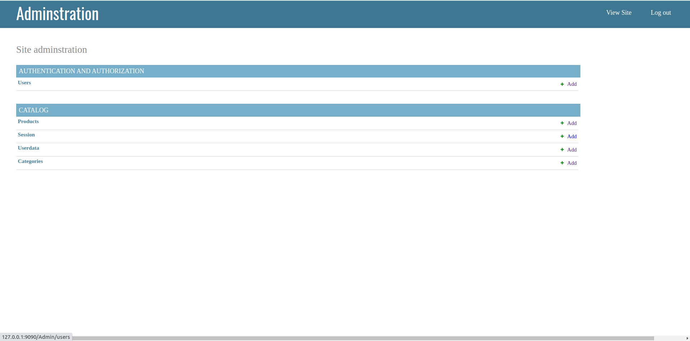
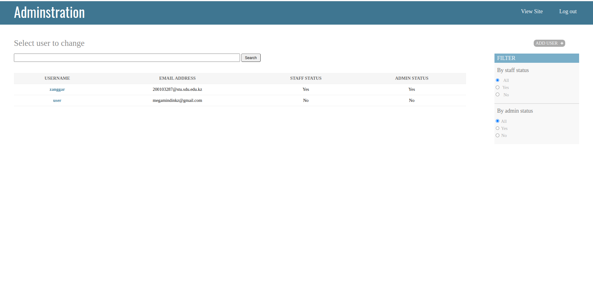
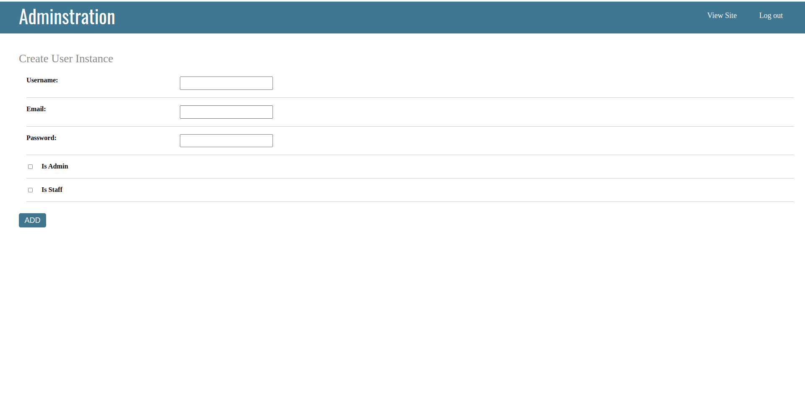
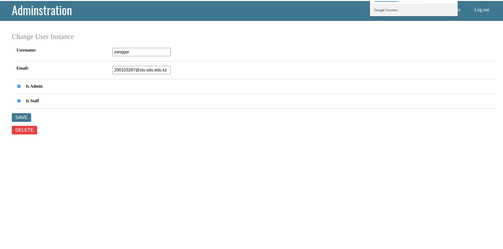

# Progress report 6

## Report on Last Week's Activities:

Last week was a busy and productive one as we prepared for our midterm1 project. We focused on several key areas, including creating templates, improving error handling, and implementing a jwt token for authentication. Additionally, we designed an admin panel for users and created a categories table.

- Admin panel design templates:  
One of the primary goals of the week was to create templates that could be used for the project. We spent time researching and designing templates that were visually appealing, easy to use, and could be adapted to meet our needs. We also focused on ensuring that the templates were responsive and could be used across different devices and platforms.

- Error Handling:  
Another critical area of focus was error handling. We identified potential error scenarios that could occur in the project and worked on creating effective error messages that would help users quickly identify and resolve the issue. We also worked on improving the user experience by creating error messages that were clear and concise, rather than generic or confusing.

- JWT Token:  
To enhance security, we implemented a jwt token for authentication. This token would be used to ensure that only authorized users could access specific features or data in the project. We spent time testing and refining this authentication process to ensure that it was robust and effective.

- Admin Panel for Users and Categories:  
Finally, we designed an admin panel for users and created a categories table. This would allow administrators to manage users and categories easily. The categories table would help organize and classify data in the project, while the admin panel would provide an easy-to-use interface for managing user accounts.

Overall, last week was a busy but productive week as we worked on various aspects of our midterm1 project. We made significant progress and are excited to continue refining and improving our work as we move forward.