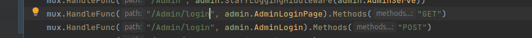

# Progress Report 7

This week, we took a bit of a break from our project after the midterm, as we were feeling a bit tired. However, we still managed to make some progress and accomplished several tasks.

## What we did?

- Middleware Functions:  
One of the key things we did was to add logging admin middleware and staff middleware functions. These would help us track and manage user activities and access levels, respectively. We also added an update function for users and categories in the admin panel, which would allow administrators to edit and update user and category information easily.
Example:

- Different Functions for Different request methods:  
Additionally, we started to write different methods for different types of request methods, rather than relying on if conditions. This would help us create more efficient and streamlined code, as well as make it easier to manage and update in the future.
Example:

- Changing table attributes:
We also made some changes to the structure of the Product and Item tables, removing any unnecessary parameters that were not needed. This would help streamline the tables and make them more efficient.

- Cleaning Code:  
We have a lot of unneeded lines and functions. We are started to clean our code. It's trickier than I thought

## What we are going to do?

Moving forward, our focus will be on adding middleware to all handler functions, as well as eliminating all if conditions for request methods. We will also be working on implementing more error handlers to improve the user experience and make it easier for users to troubleshoot any issues.

Additionally, we will be working on adding features related to products, such as images and sizes. This will help improve the functionality of the project and make it more useful for users.

Overall, while this week was a bit slower than previous weeks due to the need for a break after the midterm, we still managed to make some important progress and lay the foundation for future improvements.