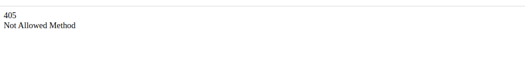
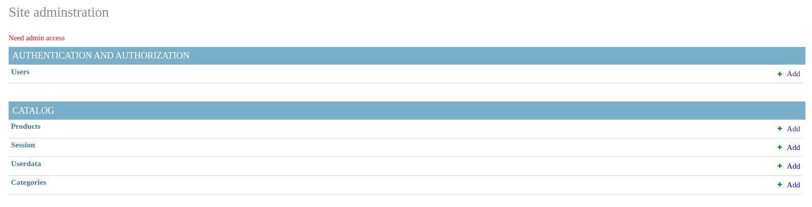
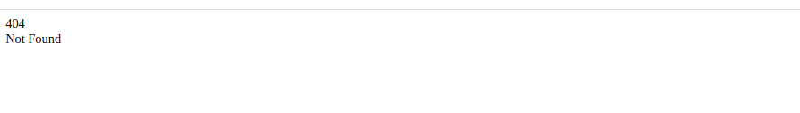
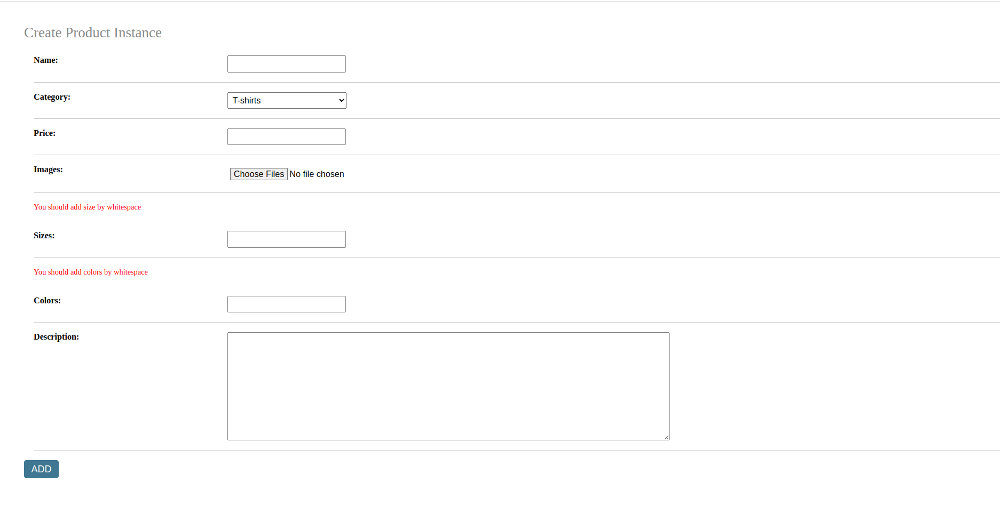
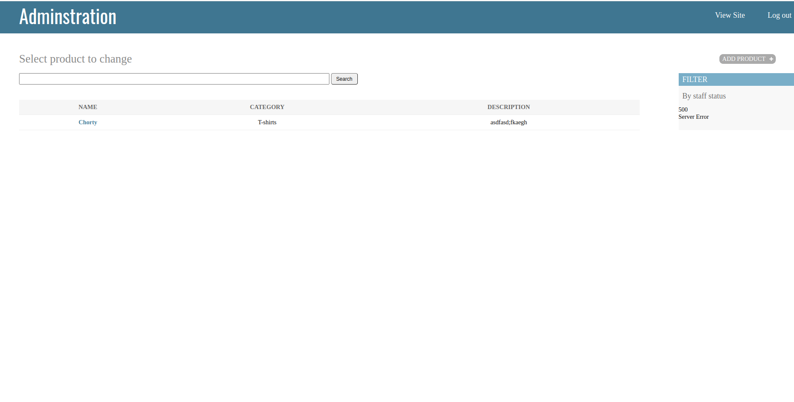

# Progress Report 8

## What we did?

- Error Handling
- More User Experience
- Product add page and feature
- Products page

### Error Handling 
During this week, we focused on enhancing the user experience and improving error handling in our web application. We started by adding middleware to all requests that require it, ensuring that the application is secure and protected against malicious attacks.

### More User Experience
To improve the user experience, we added more user-friendly messages throughout the application. These messages help users understand what is happening and provide guidance on how to proceed. We also added an error page that provides users with information about errors that occur while using the application. This page is designed to be easy to understand and use, making it easier for users to recover from errors.

#### Examples:

### Product add page and feature

One of the major updates we made this week was the addition of a page that allows staff members to add new products to the application. This page is only accessible to staff members and provides a simple form that allows them to input the necessary information for a new product. We also added a feature that allows users to copy a photo and save it to the database from the form, making it easier to add images to product listings.

### Products page

Finally, we added an admin page that provides staff members with access to administrative features such as user management, product management, and order tracking. This page is designed to be easy to use and provides staff members with the tools they need to manage the application efficiently.

## Conclusion

Overall, we made significant improvements to the application this week, enhancing the user experience and improving the functionality of the application. We are excited to continue building on this progress and look forward to sharing more updates in the future.