# Progress Report 9

During the past week, our team has been working on developing new functionalities for our e-commerce platform. Specifically, we focused on four main tasks: product item function, retrieving products of a certain category, product filter function with a rating filter, and rating add function. Below is a detailed overview of our progress and achievements in each area.

## What we did?
- Items function
- Category Products function and page
- Product filter function
- Rating add function

### Product Item Function:
We developed a product item function that allows users to view detailed information about a specific product. This function retrieves data from our database and displays it on a separate page. Users can see the product image, name, description, price, and other relevant information. 
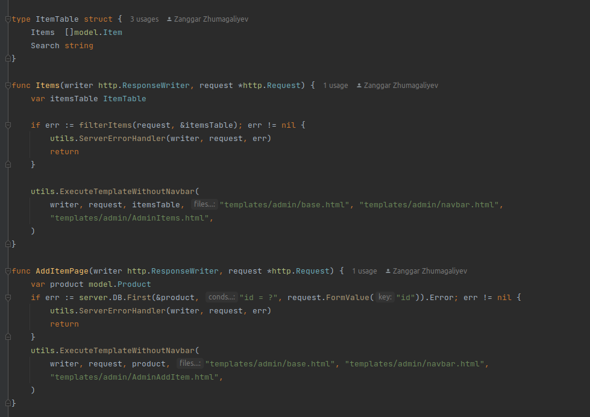
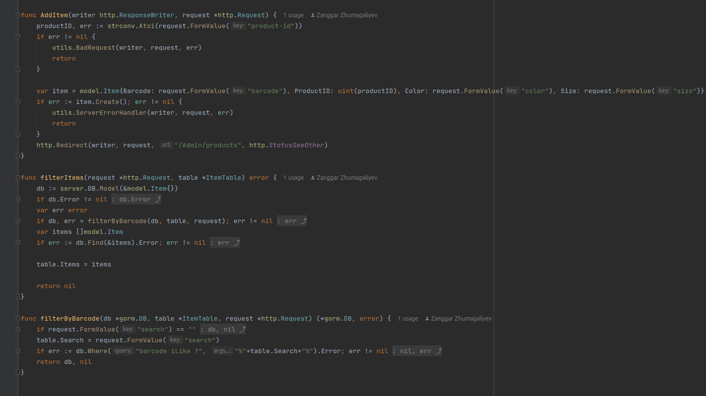
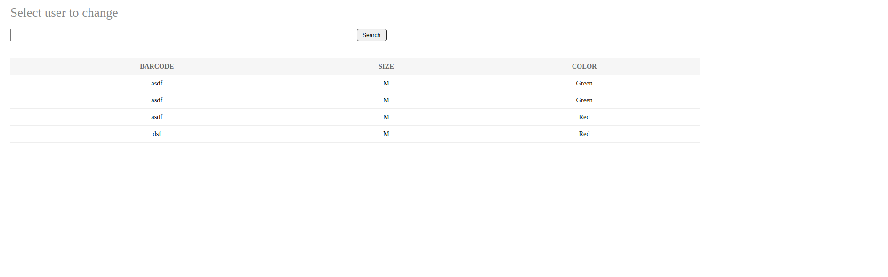

### Retrieving Products of a Certain Category:
We also added a new feature that enables users to search for products by category. Users can select a category from a drop-down menu, and our system retrieves all products that belong to that category from the database. 
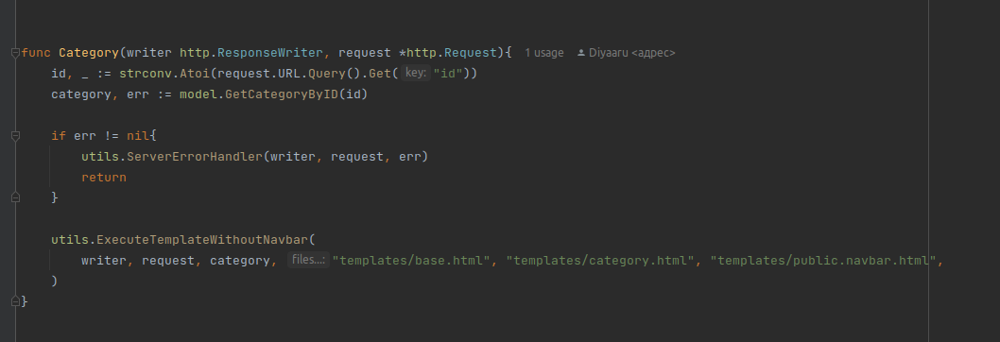
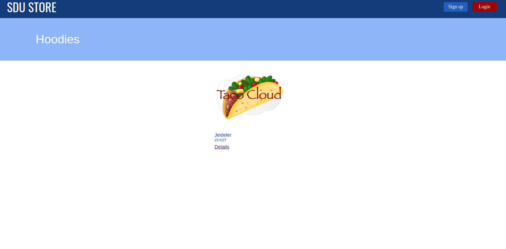

### Product Filter Function without a Rating Filter:

This feature was especially useful for users who had specific preferences when shopping for products.

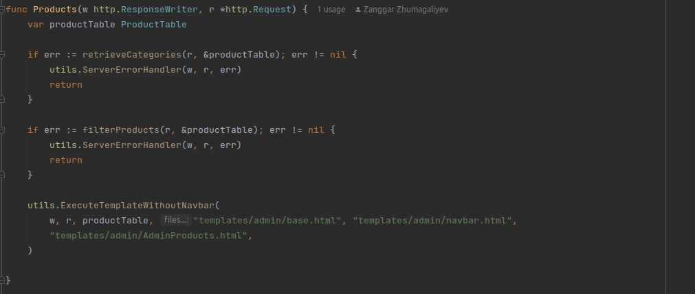
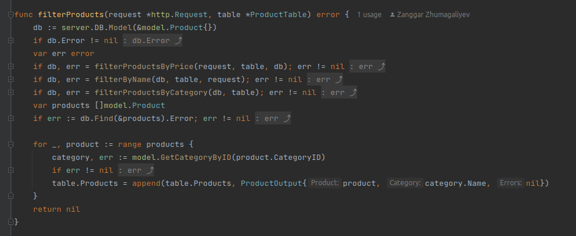
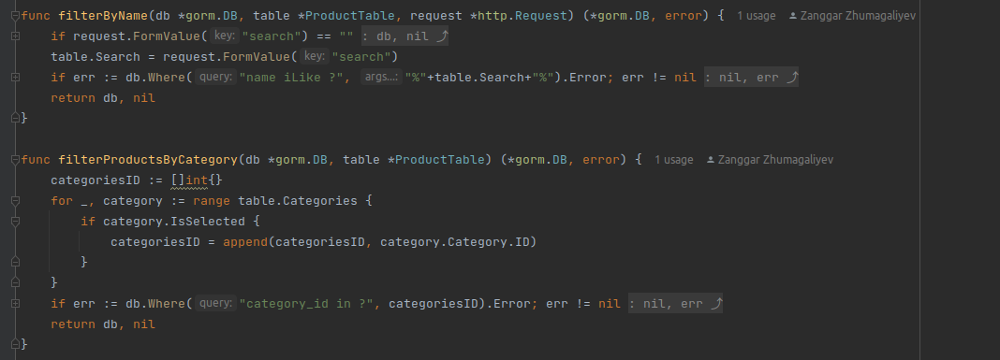
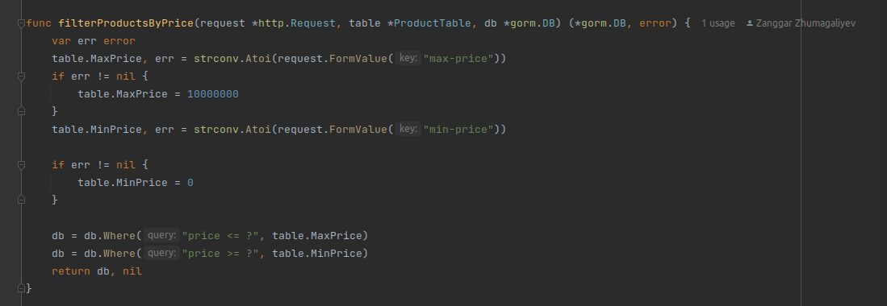
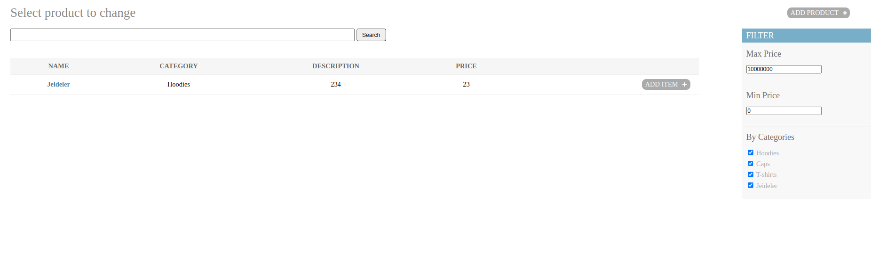

### Rating add function:

This feature allowed users to rate products they had purchased or used. Users could rate products on a scale of 1 to 5 and leave comments about their experience. This feature helped other users make informed decisions when purchasing products and also provided valuable feedback to the product sellers.

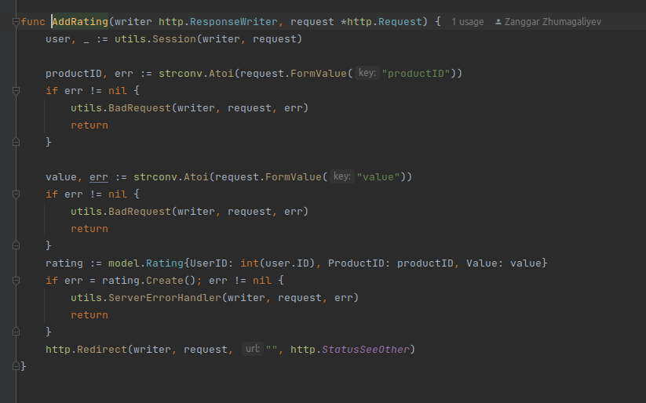

## Conclusion:
In conclusion, this week we worked on several features related to products in our application. We implemented the product item function, retrieving products of a certain category, product filter function without rating filter, and rating add function. These features improved the user experience and provided more options for users to find and purchase the products they needed.
